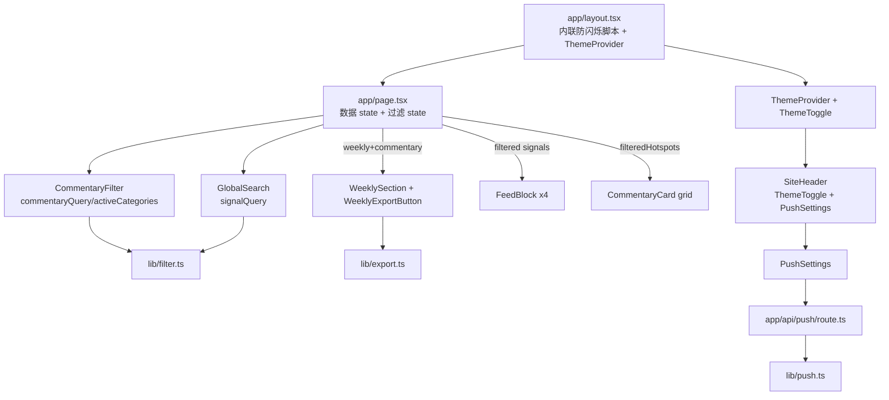
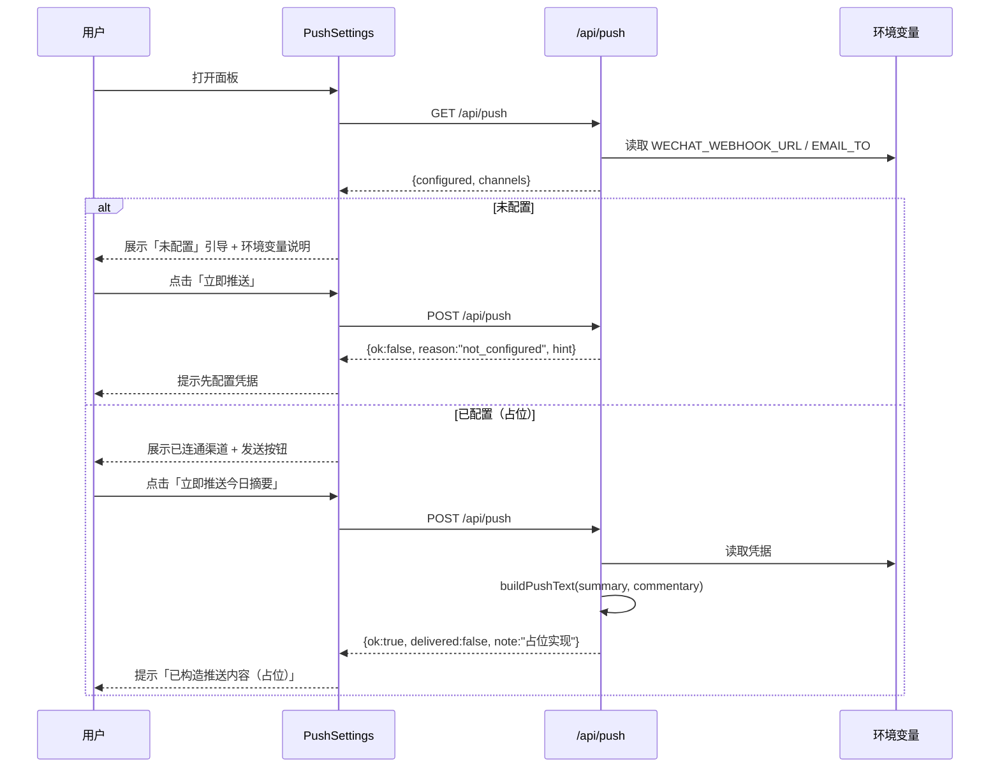
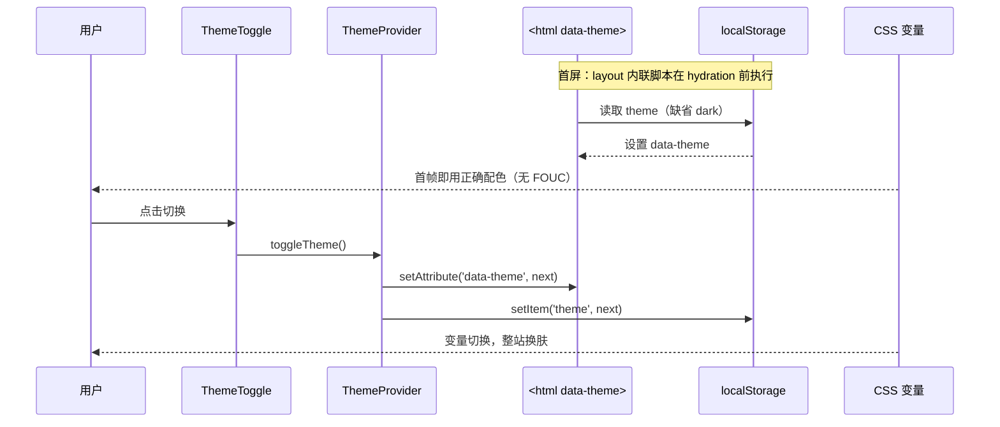

# 增量架构设计文档：前沿 · AI 日报（四项增强）

- **日期**：2026-07-18
- **基线**：已运行的 Next.js 14 App Router 项目（`frontier-ai-daily`），本地 dev server 在 `http://localhost:3000`
- **技术栈**：Next.js 14.2.5（App Router） + TypeScript 5.4 + Tailwind CSS 3.4 + Framer Motion 11 + lucide-react 0.408 + date-fns 3.6
- **路径别名**：`@/*` → 项目根
- **本次范围**：仅设计 + 任务分解，**不含实现代码**

---

## 0. 总体架构与组合方式

四个增强均叠加在既有 `app/page.tsx`（客户端组件，持有全部 fetched 数据 state）之上，遵循「**数据只读、UI 状态独立、纯客户端派生**」三原则：

```
<ThemeProvider>                      // 新增：主题 Context，挂在 <html data-theme> 上
  <SiteHeader>                      // 改造：新增 ThemeToggle + PushSettings
    [GlobalSearch]                  // 新增：顶部全局搜索（写 signalQuery）
  </SiteHeader>
  <main>
    <Hero/>
    [CommentaryFilter]              // 新增：评论区搜索 + 6 类 chips（写 commentaryQuery / activeCategories）
    AI 每日评论网格（按派生 filteredHotspots 渲染）
    [GlobalSearch 结果] 实时信号网格（按派生 filteredGithub/News/Papers/Articles 渲染）
    本周分类总结（SectionHeading 旁挂 [WeeklyExportButton]）
  </main>
</ThemeProvider>
```

- 搜索/筛选/主题/导出/推送 **全部是纯客户端能力**，不改动任何现有 `GET` 数据接口的契约。
- 唯一新增的 **服务端** 接口是 `POST/GET /api/push`，且本期为「可运行骨架 + 未配置态」。

---

## 1. 设计决策总览

| 增强 | 核心决策 |
|------|----------|
| 搜索 + 分类筛选 | 在 `page.tsx` 内新增 3 个 UI state（`commentaryQuery` / `activeCategories` / `signalQuery`），用 `useMemo` 派生过滤结果；过滤逻辑抽到纯函数 `lib/filter.ts`，便于单测；评论区与顶部各一个受控搜索组件 |
| 深 / 浅主题 | 引入语义 CSS 变量（`:root` 深色、`[data-theme="light"]` 浅色）+ 语义组件类（`.text-fg` / `.surface` / `.glass` / `.card` 等）替换散落的 `text-white/xx`；`ThemeProvider` + `localStorage` 持久化；`layout.tsx` `<head>` 内联脚本防首屏闪烁 |
| 周报 Markdown 导出 | 纯函数 `lib/export.ts#buildWeeklyMarkdown(summary, commentary?)` 生成结构化 MD；`WeeklyExportButton` 用 `Blob` + `<a download>` 触发下载 `weekly-YYYY-MM-DD.md` |
| 企微 / 邮件推送 | 新增 `app/api/push/route.ts`：`GET` 返回配置状态、`POST` 校验环境变量，未配置返回 `{ok:false, reason:"not_configured", hint}`，已配置则构造摘要并「占位发送」（logging + TODO）；`PushSettings` 面板展示连接态与未配置引导 |

---

## 2. 增强一：搜索 + 分类筛选

### 2.1 状态形状（位于 `app/page.tsx`）

```ts
// 评论区筛选
const [commentaryQuery, setCommentaryQuery] = useState<string>("");
const [activeCategories, setActiveCategories] = useState<Category[]>([]); // 空数组 = 全部
// 顶部全局信号筛选
const [signalQuery, setSignalQuery] = useState<string>("");
```

派生（纯客户端，不修改已拉取的原数组）：

```ts
const filteredHotspots = useMemo(
  () => filterHotspots(commentary?.hotspots ?? [], commentaryQuery, activeCategories),
  [commentary, commentaryQuery, activeCategories]
);
const filteredGithub = useMemo(
  () => matchSignal(github, signalQuery, (r) => [r.name, r.description ?? ""]),
  [github, signalQuery]
);
// news → [title, author, tags.join]; papers → [title, summary]; articles → [title, description]
```

### 2.2 过滤语义

- `commentaryQuery` 为空 → 不过滤；否则对 `title / summary / thinking / learning[]` 做大小写无关的子串匹配（命中其一即保留）。
- `activeCategories` 为空 → 不过滤；否则 `hotspot.category ∈ activeCategories` 才保留（多选 OR）。
- 两个维度在评论区内是 **AND**（既要匹配关键字，又要命中选中分类）。
- 全局 `signalQuery` 仅作用于四个实时信号卡片标题/描述，不影响评论区。

### 2.3 关键文件与签名

`lib/filter.ts`（CREATE，纯函数）：

```ts
export const CATEGORIES: Category[] = [
  "AI大模型", "GitHub开源", "软件工程", "Agent与智能体", "行业动态", "论文研究",
];

export function filterHotspots(
  items: Hotspot[], query: string, cats: Category[]
): Hotspot;

export function matchSignal<T>(
  items: T[], query: string, fields: (item: T) => string[]
): T[];
```

`components/CommentaryFilter.tsx`（CREATE，受控）：

```ts
interface CommentaryFilterProps {
  query: string;
  onQueryChange: (q: string) => void;
  selected: Category[];
  onToggleCategory: (c: Category) => void;
  onClear: () => void;
  resultCount: number; // 用于「命中 N 条」提示
}
```

`components/GlobalSearch.tsx`（CREATE，受控）：

```ts
interface GlobalSearchProps {
  value: string;
  onChange: (v: string) => void;
  placeholder?: string;
}
```

`app/page.tsx`（MODIFY）：新增上述 3 个 state + `useMemo` 派生；在 AI 评论区 `<SectionHeading>` 下方挂载 `<CommentaryFilter>`；在 `<main>` 顶部（`<SiteHeader>` 之后、`<Hero>` 之前）挂载 `<GlobalSearch value={signalQuery} onChange={setSignalQuery}/>`；把 `filteredHotspots` 传给评论网格、`filteredGithub/News/Papers/Articles` 传给各自 `FeedBlock` 的子节点。

> 边界建议（可选）：当 `signalQuery` 有值但某 FeedBlock 过滤后为空时，将空态文案从「暂无可用的 X 数据」改为「无匹配结果」，以区分「无数据」与「被过滤」。

---

## 3. 增强二：深 / 浅主题切换

### 3.1 语义 CSS 变量（写入 `app/globals.css`）

`:root`（默认深色，等价于当前硬编码值）：

```css
:root {
  --bg: #05060a;
  --fg: #e6e8ef;
  --fg-strong: rgba(230,232,239,0.92);
  --fg-muted:  rgba(230,232,239,0.66);
  --fg-subtle: rgba(230,232,239,0.42);
  --surface:    rgba(255,255,255,0.04);
  --surface-2:  rgba(255,255,255,0.07);
  --surface-3:  rgba(255,255,255,0.10);
  --border:        rgba(255,255,255,0.10);
  --border-strong: rgba(255,255,255,0.18);
  --glass-bg:  rgba(10,12,20,0.55);
  --header-bg: rgba(10,12,20,0.70);
  --glow-1: rgba(59,130,246,0.18);
  --glow-2: rgba(139,92,246,0.16);
  --glow-3: rgba(34,211,238,0.12);
  --shadow-card: 0 8px 40px -12px rgba(0,0,0,0.6);
}
```

`[data-theme="light"]`（浅灰/白底 + 柔和彩色光晕，品牌色不变）：

```css
[data-theme="light"] {
  --bg: #f5f7fb;
  --fg: #0f172a;
  --fg-strong: rgba(15,23,42,0.92);
  --fg-muted:  rgba(15,23,42,0.66);
  --fg-subtle: rgba(15,23,42,0.45);
  --surface:    rgba(15,23,42,0.03);
  --surface-2:  rgba(15,23,42,0.05);
  --surface-3:  rgba(15,23,42,0.08);
  --border:        rgba(15,23,42,0.10);
  --border-strong: rgba(15,23,42,0.18);
  --glass-bg:  rgba(255,255,255,0.65);
  --header-bg: rgba(255,255,255,0.72);
  --glow-1: rgba(59,130,246,0.14);
  --glow-2: rgba(139,92,246,0.13);
  --glow-3: rgba(34,211,238,0.12);
  --shadow-card: 0 8px 30px -12px rgba(15,23,42,0.15);
}
```

`body` 改为变量驱动（深色/浅色共用同一套光晕变量）：

```css
body {
  background-color: var(--bg);
  color: var(--fg);
  background-image:
    radial-gradient(1200px 600px at 12% -10%, var(--glow-1), transparent 60%),
    radial-gradient(1000px 500px at 95% 0%,  var(--glow-2), transparent 55%),
    radial-gradient(900px 600px at 50% 120%, var(--glow-3), transparent 60%);
  background-attachment: fixed;
}
```

### 3.2 语义组件类（写入 `@layer components`）

```css
.text-fg        { color: var(--fg); }
.text-fg-strong { color: var(--fg-strong); }
.text-fg-muted  { color: var(--fg-muted); }
.text-fg-subtle { color: var(--fg-subtle); }

.surface     { background-color: var(--surface); }
.surface-2   { background-color: var(--surface-2); }
.surface-3   { background-color: var(--surface-3); }

.border-line       { border-color: var(--border); }
.border-line-strong{ border-color: var(--border-strong); }

.glass {
  background-color: var(--glass-bg);
  border: 1px solid var(--border);
  backdrop-filter: blur(20px);
  -webkit-backdrop-filter: blur(20px);
}
.card {
  background-color: var(--glass-bg);
  border: 1px solid var(--border);
  border-radius: 1rem;            /* rounded-2xl */
  box-shadow: var(--shadow-card);
  backdrop-filter: blur(20px);
  -webkit-backdrop-filter: blur(20px);
  transition: all .3s ease;
}
.card-hover:hover {
  border-color: var(--border-strong);
  background-color: var(--surface-2);
}
.topbar {
  background-color: var(--header-bg);
  border-bottom: 1px solid var(--border);
  backdrop-filter: blur(20px);
  -webkit-backdrop-filter: blur(20px);
}
/* chip / pill / section-title / skeleton 内部同步改用 --border / --surface / --fg-* */
```

> 迁移注意：`.card` 直接展开 `.glass` 的属性（**避免 `@apply glass` 的层序问题**）。`.gradient-text`、品牌色类（`text-brand-*`、`bg-brand-*`、`from-brand-cyan` 等）**保持不变**——它们已是固定色，深浅主题都可用。

### 3.3 散落工具类 → 语义类 映射表（工程师替换清单）

| 现状（深色硬编码） | 替换为 |
|---|---|
| `text-white` | `text-fg` |
| `text-white/90` `text-white/85` | `text-fg-strong` |
| `text-white/80` `/75` `/70` | `text-fg-muted` |
| `text-white/60` `/55` `/50` `/45` `/40` `/35` `/30` | `text-fg-subtle` |
| `bg-white/5` | `surface` |
| `bg-white/[0.04]` | `glass`（作玻璃底时）或 `surface` |
| `bg-white/[0.06]` | `surface-2` |
| `bg-white/10` | `surface-3` |
| `border-white/10` | `border-line` |
| `border-white/15` `border-white/20` | `border-line-strong` |
| `bg-ink-950/70`（Header 栏） | `topbar` 类 |
| `bg-white/5` + `border-white/10`（各类 chip/icon 容器） | `surface` + `border-line` |

### 3.4 ThemeProvider 接口

`components/ThemeProvider.tsx`（CREATE，客户端组件）：

```ts
type Theme = "dark" | "light";
interface ThemeContextValue {
  theme: Theme;
  setTheme: (t: Theme) => void;
  toggleTheme: () => void;
}
// 导出：ThemeProvider({children}) 与 useTheme(): ThemeContextValue
// 行为：
//  - 初始化：从 document.documentElement.dataset.theme 读取（该值由 layout 内联脚本在 hydration 前设置）
//  - setTheme/toggleTheme：写入 document.documentElement.dataset.theme 并 localStorage.setItem("theme", t)
//  - localStorage key：theme
```

`app/layout.tsx`（MODIFY）：

```tsx
<html lang="zh-CN" suppressHydrationWarning>
  <head>
    {/* 防首屏闪烁：hydration 前根据 localStorage 设置 data-theme */}
    <script dangerouslySetInnerHTML={{ __html:
      `(function(){try{var t=localStorage.getItem('theme');if(t!=='light'&&t!=='dark'){t='dark';}document.documentElement.setAttribute('data-theme',t);}catch(e){document.documentElement.setAttribute('data-theme','dark');}})();`
    }} />
  </head>
  <body>
    <ThemeProvider>{children}</ThemeProvider>
  </body>
</html>
```

### 3.5 防首屏闪烁（FOUC）方案

1. 内联脚本在 `<head>` 中、React hydration 之前执行，依据 `localStorage.theme`（缺省 `dark`）给 `<html>` 打 `data-theme`。
2. CSS 变量随 `data-theme` 立即生效，首帧即正确配色，无闪白。
3. `<html suppressHydrationWarning>` 避免服务端（默认 dark）与客户端首帧（可能为 light）的 HTML 属性不一致告警。
4. `ThemeProvider` 初始 state 以 DOM 上既有 `data-theme` 为准（视觉由 CSS 控制，不因 React state 延迟而闪烁）；toggle 后同步 DOM + localStorage。

### 3.6 浅色主题视觉策略

- 背景用浅灰/白（`--bg:#f5f7fb`）+ 柔和品牌色光晕（`--glow-1/2/3`），**非简单反色**。
- 玻璃拟态在浅色下改用半透明白 + 浅边框 + 淡阴影，保持「通透」而非「发灰」。
- 卡片 hover 用 `--surface-2` 微提亮 + `--border-strong` 描边，保持交互反馈。
- 品牌色（cyan/blue/violet/pink/emerald/amber）在所有主题保持一致，保证识别度。

---

## 4. 增强三：周报一键导出 Markdown

### 4.1 导出结构（`weekly-YYYY-MM-DD.md`）

```markdown
# 前沿 · AI 日报 · 本周热点总结

> 周期：{weekStart} ~ {weekEnd} · 共 {totalHotspots} 条热点

## 本周趋势判断
{keyTrend}

## 本周学习重心
- {learningFocus[0]}
- {learningFocus[1]}
- …

## 热点分类分布
### {bucket.category}（{bucket.count} 条）
1. **{hotspot.title}** — 来源：{hotspot.source} · 重要性：{hotspot.importance}
   - 摘要：{hotspot.summary}
   - 思考：{hotspot.thinking}
   - 怎么学：{hotspot.learning.join("；")}
   - 链接：{hotspot.link || "—"}
   （每个 bucket 下 hotspot 全量列出）

## 今日速览（来自最新每日评论）
- 标题：{commentary.headline}
- 行动建议：{commentary.takeaways.join("；")}
```

### 4.2 关键文件与签名

`lib/export.ts`（CREATE，纯函数，无 DOM 依赖）：

```ts
export function buildWeeklyMarkdown(
  summary: WeeklySummary,
  commentary?: DailyCommentary | null
): string;
```

`components/WeeklyExportButton.tsx`（CREATE，客户端）：

```ts
interface WeeklyExportButtonProps {
  summary: WeeklySummary;
  commentary?: DailyCommentary | null;
}
// onClick：
//   const md = buildWeeklyMarkdown(summary, commentary);
//   const blob = new Blob([md], { type: "text/markdown;charset=utf-8" });
//   const url = URL.createObjectURL(blob);
//   const a = document.createElement("a");
//   a.href = url; a.download = `weekly-${new Date().toISOString().slice(0,10)}.md`;
//   a.click(); URL.revokeObjectURL(url);
```

`app/page.tsx`（MODIFY）：在「本周分类总结」`<SectionHeading>` 旁渲染 `<WeeklyExportButton summary={weekly} commentary={commentary} />`（仅在 `weekly` 存在时显示）。

---

## 5. 增强四：企微 / 邮件推送（基础设施 + 未配置态）

### 5.1 路由设计 `app/api/push/route.ts`（CREATE）

```ts
export const dynamic = "force-dynamic";

// GET → 返回当前配置状态（供 UI 展示连接态）
export async function GET() {
  const channels = {
    wechat: !!process.env.WECHAT_WEBHOOK_URL,
    email:  !!process.env.EMAIL_TO,
  };
  return NextResponse.json({
    ok: true,
    configured: channels.wechat || channels.email,
    channels,
  });
}

// POST → 校验凭据；未配置返回 not_configured；已配置构造摘要并「占位发送」
export async function POST(req: Request) {
  const wechat = process.env.WECHAT_WEBHOOK_URL;
  const email  = process.env.EMAIL_TO;
  if (!wechat && !email) {
    return NextResponse.json({
      ok: false,
      reason: "not_configured",
      hint: "请配置推送凭据环境变量：WECHAT_WEBHOOK_URL（企业微信群机器人 Webhook）或 EMAIL_TO（接收邮箱）。",
    });
  }
  const summary = getWeeklySummary();
  const commentary = getLatestCommentary();
  const text = buildPushText(summary, commentary);
  // TODO：真实发送 —— 企业微信 POST wechat，body {msgtype:"markdown",markdown:{content:text}}；
  //       邮件通过 SMTP/邮件 API 发送 text。本期仅占位：
  console.log("[push] payload constructed, channels:", { wechat: !!wechat, email: !!email });
  return NextResponse.json({
    ok: true,
    delivered: false,
    note: "已构造推送内容（占位实现，待接入真实发送逻辑）",
    channels: { wechat: !!wechat, email: !!email },
  });
}
```

> 响应信封统一为 `{ ok, ... }`（与现有 `{ok:true,data,...}` 风格一致）；未配置态用 `reason:"not_configured"` + 人类可读 `hint`。

`lib/push.ts`（CREATE，纯函数）：

```ts
export function buildPushText(
  summary: WeeklySummary,
  commentary?: DailyCommentary | null
): string; // 返回适合企业微信 markdown / 邮件正文的纯文本摘要
```

### 5.2 「推送设置」UI `components/PushSettings.tsx`（CREATE）

- Header 内的按钮（如 `Send` 图标）+ 下拉轻量面板。
- 打开面板时 `GET /api/push` 获取 `{configured, channels}`：
  - **未配置**：展示提示「尚未配置推送凭据」，并给出环境变量配置说明（含 `WECHAT_WEBHOOK_URL` / `EMAIL_TO` 示例）。
  - **已配置**：展示已连通渠道（企微 / 邮件），提供「立即推送今日摘要」按钮。
- 「立即推送今日摘要」→ `POST /api/push` → 根据返回渲染结果：
  - `ok:false, reason:"not_configured"` → 提示先去配置；
  - `ok:true` → 提示「已构造推送内容（占位）」。
- 内部 state：`open` / `status` / `sending` / `result`。

### 5.3 SiteHeader 改造

`components/SiteHeader.tsx`（MODIFY）：在右侧操作区新增 `<ThemeToggle/>` 与 `<PushSettings/>`（二者均依赖已建立的语义类与主题变量）。

### 5.4 环境变量示例 `.env.example`（CREATE）

```
# 推送凭据（可选；不配置时推送功能区显示「未配置」态，不影响其他功能）
WECHAT_WEBHOOK_URL=
EMAIL_TO=
```

### 5.5 每日自动化任务约定（仅标注，不改自动化）

在每日自动化任务的 prompt 中预留如下说明（供后续接入，本期不实现调用）：

> 「若站点已配置推送（环境变量 `WECHAT_WEBHOOK_URL` / `EMAIL_TO`），在完成当日数据更新后调用 `POST /api/push` 推送今日摘要；若未配置则跳过此步。」

---

## 6. 共享约定（Cross-cutting）

| 类别 | 约定 |
|------|------|
| CSS 变量 | `--bg / --fg / --fg-strong / --fg-muted / --fg-subtle / --surface / --surface-2 / --surface-3 / --border / --border-strong / --glass-bg / --header-bg / --glow-1/2/3 / --shadow-card` |
| 语义类 | `.text-fg` `.text-fg-strong` `.text-fg-muted` `.text-fg-subtle` `.surface` `.surface-2` `.surface-3` `.border-line` `.border-line-strong` `.glass` `.card` `.card-hover` `.topbar` |
| ThemeProvider | `useTheme()` → `{ theme, setTheme, toggleTheme }`；localStorage key `theme`；`<html data-theme>` |
| 搜索/筛选 state | `commentaryQuery:string`、`activeCategories:Category[]`（空=全部）、`signalQuery:string` |
| 过滤纯函数 | `filterHotspots(items, query, cats)`、`matchSignal<T>(items, query, fields)`、`CATEGORIES: Category[]` |
| 导出签名 | `buildWeeklyMarkdown(summary, commentary?): string`；下载名 `weekly-YYYY-MM-DD.md` |
| 推送签名 | `buildPushText(summary, commentary?): string`；路由 `GET /api/push`（状态）、`POST /api/push`（发送） |
| API 响应信封 | 既有：`{ok:true,data,...}`（commentary 另含 `hasData`，信号路由另含 `count`）；新增 push：`{ok:false,reason:"not_configured",hint}` 或 `{ok:true,delivered:false,note,channels}` |
| 类别常量 | `CATEGORIES` 取自 `lib/types.ts` 的 `Category` 联合类型，顺序：AI大模型 / GitHub开源 / 软件工程 / Agent与智能体 / 行业动态 / 论文研究 |

---

## 7. 完整文件清单

| 相对路径 | 变更 | 用途 | 关键改动点 |
|----------|------|------|-----------|
| `app/globals.css` | MODIFY | 主题变量 + 语义类 | 新增 `:root` 与 `[data-theme="light"]` 变量块；`body` 改变量驱动；`@layer components` 写入语义类；`.chip/.pill/.section-title/.skeleton` 改用变量 |
| `app/layout.tsx` | MODIFY | 防闪烁 + 主题 Provider | `<head>` 注入内联 `data-theme` 脚本；`<html suppressHydrationWarning>`；`<body>` 用 `<ThemeProvider>` 包裹 |
| `components/ThemeProvider.tsx` | CREATE | 主题 Context | `useTheme()`、`localStorage` 持久化、`data-theme` 同步、`toggleTheme` |
| `components/ThemeToggle.tsx` | CREATE | 主题切换按钮 | 太阳/月亮图标，调用 `toggleTheme` |
| `lib/filter.ts` | CREATE | 过滤纯函数 | `CATEGORIES`、`filterHotspots`、`matchSignal` |
| `components/CommentaryFilter.tsx` | CREATE | 评论区搜索 + 6 类 chips | 受控：搜索框 + 多选分类 chips + 「全部」清除 |
| `components/GlobalSearch.tsx` | CREATE | 顶部全局搜索框 | 受控输入，写 `signalQuery` |
| `app/page.tsx` | MODIFY | 搜索 state + 派生 + 挂载 | 新增 3 个 state + `useMemo` 过滤；挂载 `CommentaryFilter` 与 `GlobalSearch`；过滤后数组传入评论网格与 4 个 FeedBlock；周报区挂 `WeeklyExportButton` |
| `lib/export.ts` | CREATE | 周报 Markdown 生成 | `buildWeeklyMarkdown(summary, commentary?)` |
| `components/WeeklyExportButton.tsx` | CREATE | 导出按钮 + Blob 下载 | 调用 `buildWeeklyMarkdown` + `<a download>` |
| `app/api/push/route.ts` | CREATE | 推送路由 | `GET` 配置状态；`POST` 校验环境变量，未配置返回 `not_configured`，已配置占位发送 |
| `lib/push.ts` | CREATE | 推送摘要构造 | `buildPushText(summary, commentary?)` |
| `components/PushSettings.tsx` | CREATE | 推送设置面板 | Header 按钮 + 下拉；连接态展示 + 未配置引导 + 触发 `POST /api/push` |
| `components/SiteHeader.tsx` | MODIFY | 接入主题/推送 | 新增 `<ThemeToggle/>` 与 `<PushSettings/>`；迁移 `text-white/xx`、`bg-ink-950/70` → 语义类/`.topbar` |
| `components/ui.tsx` | MODIFY | 设计原语语义化 | `.chip/.pill/.section-title/.gradient-text` 改用变量；可选新增 `SearchInput` 原语 |
| `components/Hero.tsx` | MODIFY | 语义化迁移 | `text-white/xx` → 语义类 |
| `components/CommentaryCard.tsx` | MODIFY | 语义化迁移 | `text-white/xx`、`bg-white/xx`、`border-white/xx` → 语义类 |
| `components/cards.tsx` | MODIFY | 语义化迁移 | 4 张卡片的 `text-white/xx`、`bg-white/xx`、`border-white/xx` → 语义类 |
| `components/WeeklySection.tsx` | MODIFY | 语义化迁移 | `text-white/xx`、`bg-white/xx` → 语义类（结构不变） |
| `.env.example` | CREATE | 推送环境变量示例 | `WECHAT_WEBHOOK_URL`、`EMAIL_TO` |

---

## 8. 有序任务清单（按实现顺序 + 依赖）

| ID | 任务 | 关键文件 | 依赖 | 优先级 |
|----|------|----------|------|--------|
| T1 | **主题基础设施**：语义变量 + 语义类 + ThemeProvider + 防闪烁脚本 | `app/globals.css`、`app/layout.tsx`、`components/ThemeProvider.tsx`、`components/ThemeToggle.tsx` | 无 | P0 |
| T2 | **全站语义化迁移**：替换散落 `text-white/xx`、`bg-white/xx`、`border-white/xx` 为语义类 | `components/ui.tsx`、`Hero.tsx`、`CommentaryCard.tsx`、`cards.tsx`、`WeeklySection.tsx` | T1 | P0 |
| T3 | **主题切换接入 Header**：`SiteHeader` 接入 `ThemeToggle`（含 T2 的 Header 部分改动合并） | `components/SiteHeader.tsx`、`components/ThemeToggle.tsx` | T1 | P1 |
| T4 | **搜索与分类筛选**：过滤纯函数 + 评论区筛选组件 + 顶部全局搜索 + page 派生状态 | `lib/filter.ts`、`components/CommentaryFilter.tsx`、`components/GlobalSearch.tsx`、`app/page.tsx` | 无 | P0 |
| T5 | **周报 Markdown 导出**：生成函数 + 导出按钮 + page 挂载 | `lib/export.ts`、`components/WeeklyExportButton.tsx`、`app/page.tsx` | 无 | P1 |
| T6 | **推送基础设施**：push 路由 + 摘要构造 + 设置面板 + Header 接入 + 环境变量示例 | `app/api/push/route.ts`、`lib/push.ts`、`components/PushSettings.tsx`、`components/SiteHeader.tsx`、`.env.example` | 无 | P2 |
| T7 | **联调与验收**：浅色对比度、FOUC 检查、未配置态文案、过滤边界、跨主题视觉走查 | 全部上述文件 | T1–T6 | P1 |

> 实现提示：T2 与 T3 都改动 `SiteHeader.tsx`，建议在同一工作批次内完成，避免重复合并冲突。T4/T5/T6 相互独立，可与 T1/T2 并行推进。

---

## 9. 待明确 / 风险

1. **浅色主题玻璃拟态对比度**：半透明白 + 浅边框在 `#f5f7fb` 上可能对比偏弱。建议验收时用 `--surface-2` 提亮 + `--border-strong` 描边，必要时为浅色单独上调 `--border` 透明度（如 `0.12`→`0.14`）。
2. **未配置态文案**：当前 `hint` 为中文引导；需与主理人确认是否要给出 `.env.local` 的具体写入示例（已在 `.env.example` 提供）。
3. **FOUC 极端情况**：若用户浏览器禁用 `localStorage` 或脚本，内联脚本 catch 后默认 dark，不会崩；但首屏可能短暂使用 `:root` 默认（即 dark），可接受。
4. **过滤后空态**：`FeedBlock` 当前空态文案为「暂无可用的 X 数据」，被搜索过滤为空时会误导；建议区分「无数据 / 无匹配」（见 §2.3 可选项）。
5. **推送真实发送**：本期仅占位（logging + TODO），企业微信 markdown 2000 字上限、邮件 SMTP 凭据等均未实现；交付时需明确这是「可运行骨架」。
6. **`ActiveCategories` 与「全部」语义**：空数组=全部；「全部」chip 点击即清空。需与设计师确认 chips 是否支持「单选高亮某一类」还是仅多选，本设计按多选 OR 实现。
7. **主题切换对 Framer Motion `Reveal` 的影响**：动效不受影响（仅颜色变量变化），但 `whileInView` 的进入动画在主题切换后不会重放，属预期行为。

---

## 10. 附录：Mermaid 图

### 10.1 组件 / 数据流关系



### 10.2 推送流程（序列图）



### 10.3 主题切换流程（序列图）


