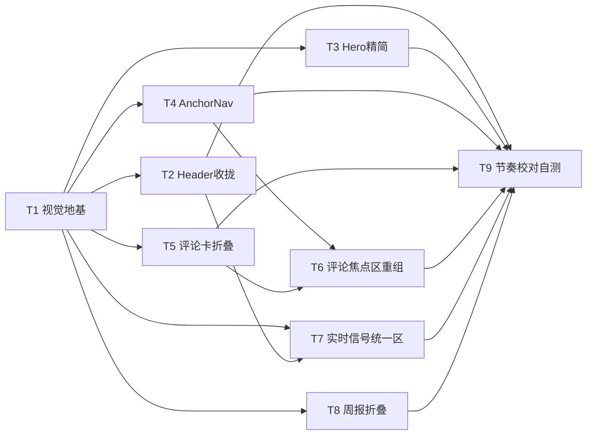

# 「前沿·AI 日报」界面整洁度改造 · 信息架构与视觉设计文档

> 目标：**收纳与聚焦**，不是加功能。把"一镜到底的信息瀑布"重做成有呼吸感、焦点清晰的分区结构。
> 技术栈：Next.js 14 App Router + TS + Tailwind + Framer Motion + lucide-react；别名 `@/*`→根。
> 约束：**仅前端改造，不新增任何网络请求**；复用既有语义主题系统（`:root`/`[data-theme=light"]` CSS 变量与 `.card/.surface/.text-fg*/.border-line/.glass/.chip/.pill` 等语义类），**不推翻主题**。

---

## 1. 现状问题清单

基于真实代码（`app/page.tsx`、`Hero.tsx`、`CommentaryCard.tsx`、`cards.tsx`、`SiteHeader.tsx`、`ui.tsx`、`GlobalSearch.tsx`、`CommentaryFilter.tsx`、`WeeklySection.tsx` 等）逐条分析：

### 1.1 信息密度过高 /「一镜到底」瀑布，无节奏
- `page.tsx` 自上而下单屏塞满：Hero（带 5 个 StatPill + 大标题 + 副标题 + ambient glow）→ 顶部独立 `GlobalSearch` → AI 评论区（**最多 8 张卡 × 3 段大文字**：summary + 我的思考 + 怎么学）→ **4 路 FeedBlock 各自 10–15 条**（GitHub/News/Papers/Articles，每路内部 2 列网格）→ 本周周报 → footer。
- 各 section 仅用 `py-8`（2rem）分隔，**没有视觉停顿/地图感**，用户一路滚到底，体验"很累、杂乱"。

### 1.2 焦点缺失：差异化价值被淹没
- 真正差异化的是 **AI 每日评论（含"我的思考 / 怎么学"）**，但：
  - 它在 Hero 与 4 路实时流**之后才出现权重感不足**；Hero 占大量首屏却主要是营销文案。
  - 评论卡 `CommentaryCard` **默认全展开** thinking/learning，8 张卡即 24 段文字，单屏密度爆炸。
- 没有"哪块最大最突出"的明确层级，所有区块视觉权重接近。

### 1.3 控件散落，搜索语义混乱
- **顶栏两行**：第一行 logo + "实时"指示 + "更新于" + ThemeToggle + PushSettings + 刷新；第二行 5 个**无交互价值的源标签**（GitHub/HN/ArXiv/dev.to/AI评论）。
- **两个搜索框、两套状态**：顶部 `GlobalSearch`（过滤 4 路信号，`signalQuery`）vs 评论区 `CommentaryFilter`（过滤评论，`commentaryQuery`）。两者位置相距甚远，用户困惑"到底搜哪个？"
- 主题切换 / 推送设置虽已是图标+下拉，但顶栏元素拥挤，第二行源标签纯属噪点。

### 1.4 节奏失衡 / 留白不足 / 无统一密度规范
- 间距靠硬编码（`py-8` / `gap-4` / `gap-6` / `p-5` / `p-4`），**没有统一的间距尺度令牌**。
- 嵌套网格噪音：实时区 `grid-cols-2 gap-6`，内部每路又 `grid-cols-2 gap-3`，4 路堆叠 → 40–60 张卡。
- **文本行数无上限**：summary/thinking/learning 可能很长，长行无 `--maxw-prose` 限制。
- Hero 能量过高（大 glow + 5 计数），与下方冷静内容脱节。

### 1.5 重复冗余
- Hero 的 5 个 StatPill（github/news/papers/articles/hotspots 计数）与下方实时信号 `count` 重复，也与顶栏第二行源标签重复。
- 顶部 `GlobalSearch` 在 Hero 上方，但过滤的是下方的"实时信号"，位置与效果脱节。

---

## 2. 新信息架构（IA）

### 2.1 页面分区结构（建议顺序与每块职责）

| # | 区块 | 职责 | 视觉权重 | 默认状态 |
|---|------|------|----------|----------|
| 0 | **SiteHeader（精简）** | 品牌 + 实时状态 + 收拢控件（主题/推送/刷新） | — | 常驻 sticky |
| 1 | **Hero（精简）** | 轻标题条：日期 + 主标题 + 一行副标题 + 1 个"今日 AI 评论 N 篇"强调 | 中（降权） | 常驻 |
| 2 | **AnchorNav 锚点条** | 地图感导航：`AI 评论 · 实时信号 · 本周周报`，平滑滚动 | 低 | sticky 于 header 下 |
| 3 | **AI 每日评论（焦点区）** ⭐ | 差异化价值：搜索/筛选 + 评论卡（**默认折叠思考/学习**）+ 加载更多 | **最高** | 焦点、置顶 |
| 4 | **实时信号（统一区块）** | 把 4 路流整合为单区：来源切换 Tab + 搜索 + 列表（默认少量 + 加载更多） | 中 | 默认显示"全部"前 N 条 |
| 5 | **本周周报（独立区）** | 趋势判断卡 +（默认折叠的）分类分布 | 低 | 趋势卡默认显，分布折叠 |
| 6 | **Footer（精简）** | 一行来源说明 | 低 | 常驻 |

### 2.2 新 IA 结构图（Mermaid）

```mermaid
flowchart TD
    H[SiteHeader 精简·单行走<br/>logo | 状态pill | 主题 | 推送 | 刷新]
    N[AnchorNav 锚点条<br/>AI评论 · 实时信号 · 本周周报]
    subgraph FOCUS[焦点区]
        HE[Hero 精简<br/>标题 + 副标题 + 今日评论N篇]
        C[AI 每日评论<br/>搜索+分类chips<br/>卡片默认折叠思考/学习<br/>默认前6条 + 加载更多]
    end
    S[实时信号 统一区块<br/>来源Tab(all/github/news/papers/articles)<br/>+ 信号搜索 + 默认前8条 + 加载更多<br/>复用4个card组件]
    W[本周周报<br/>趋势卡默认显 + 分类分布折叠]
    FT[Footer 一行]

    H --> N --> HE --> C --> S --> W --> FT
```

### 2.3 导航方式
- **锚点 + 平滑滚动**：`html{scroll-behavior:smooth}` 已存在；各 section 加 `id="commentary|signals|weekly"`，AnchorNav 用 `<a href="#...">` 跳转；并设 `scroll-margin-top` 抵消 sticky header/AnchorNav 高度。
- **来源切换**是"实时信号"区内的 Tab（状态 `activeSource: 'all'|'github'|'news'|'papers'|'articles'`），非路由。
- **渐进披露（默认折叠 / 加载更多）**：
  - 评论卡：`thinking/learning` 默认收起，点"展开思考与学习"才显。
  - 评论列表 / 信号列表：默认显示 N 条，点"加载更多"递增。
  - 周报：分类分布默认折叠，仅显"趋势判断"卡。

### 2.4 焦点层级（哪块最大最突出）
1. **AI 每日评论**（含"我的思考/怎么学"）—— 最大字号、最宽留白、置顶、视觉焦点。
2. **实时信号** —— 次级，统一收纳。
3. **本周周报** —— 三级，靠后。
- Hero 从"营销大屏"降为"轻标题条"，把首屏还给评论焦点。

---

## 3. 视觉系统规范

复用全部既有语义类，仅**新增间距/密度令牌**与少量工具类。

### 3.1 间距尺度（新增 CSS 变量，写入 `app/globals.css :root` 与 `[data-theme=light]`）
```css
--space-section: 4rem;      /* section 间垂直间距 64px（替代散落 py-8） */
--space-section-sm: 3rem;   /* 紧凑区 48px */
--space-card: 1.25rem;      /* 焦点卡内边距 20px（= p-5，保持） */
--space-card-sm: 1rem;      /* 信号卡内边距 16px（= p-4） */
--space-stack: 1.5rem;      /* 区块内元素纵向间距 24px */
--space-tight: 0.75rem;     /* 小间距 12px */
--maxw-prose: 68ch;         /* 正文行宽上限，避免长行 */
```

### 3.2 新增工具类（`globals.css` `@layer components`）
```css
.section { @apply max-w-7xl mx-auto px-4 sm:px-6; padding-top: var(--space-section); }
.section-sm { padding-top: var(--space-section-sm); }
.section-divider { border-top: 1px solid var(--border); margin-top: var(--space-section); }
/* 折叠容器：grid-rows 0fr→1fr 过渡，无需 JS 测高，性能优于 max-height */
.disclose { display: grid; grid-template-rows: 0fr; transition: grid-template-rows .3s ease; }
.disclose[data-open="true"] { grid-template-rows: 1fr; }
.disclose > .disclose-inner { overflow: hidden; }
```

### 3.3 卡片密度规则
- **评论卡（焦点）**：`p-5`（`--space-card`）。折叠态仅 category + 标题 + summary（`line-clamp-3`）；展开态追加 thinking/learning（带品牌色分隔块）。
- **信号卡**：`p-4`（`--space-card-sm`），统一 `line-clamp`（标题 2 行、描述 2–3 行）。保留 `.card` 圆角 `rounded-2xl`（1rem）与阴影。
- 实时信号区内部列表改为**单列 / 双列统一**（不再 4 列并排），来源 Tab 控制显示哪一路。

### 3.4 文本行数上限
- 评论卡 summary：折叠态 `line-clamp-3`；展开不限制。
- 信号卡标题 `line-clamp-2`、描述 `line-clamp-2~3`（已在 `cards.tsx` 用 `line-clamp-*`）。
- 正文段落最大宽度 `var(--maxw-prose)`（68ch）。

### 3.5 留白与节奏
- section 之间用 `var(--space-section)`（4rem）间距 + 可选 `.section-divider` 细分隔线，制造"呼吸"。
- 焦点区（AI 评论）section 标题更大 / 带品牌色点缀；卡片 hover 更明显，强化层级对比。

---

## 4. 组件改造清单

| 文件 | 变更类型 | 关键改动 |
|------|----------|----------|
| `app/page.tsx` | **modify** | ① 移除顶部独立 `GlobalSearch`（搜索能力移入实时信号区）；② 重排渲染顺序：Hero（精简）→ AnchorNav → AI 评论焦点区 → 实时信号统一区 → 周报区；③ 新增 state：`activeSource`、`commentaryVisible`、`signalVisible`；④ 评论列表默认前 6 条 + 加载更多；⑤ 实时信号改为单区（来源 Tab + 信号搜索 + 默认前 8 条 + 加载更多），移除内联 4 个 `FeedBlock`；⑥ `load()` 并行 6 API + `setInterval` 5min 刷新逻辑**保持不变**。 |
| `app/globals.css` | **modify** | 新增间距/密度 CSS 变量（`--space-section` 等）与 `.section`/`.section-sm`/`.section-divider`/`.disclose` 工具类。**不推翻主题**。 |
| `app/layout.tsx` | 不变 | 主题系统保留，无需改。 |
| `components/Hero.tsx` | **modify** | 精简：去除 5 个 `StatPill`（计数迁移到实时信号表头）；保留日期 chip + 主标题（`gradient-text`）+ 一行副标题；弱化 ambient glow；高度压缩（`pt-12`→`pt-8`，去 stat 行）；可选保留 1 个"今日 AI 评论 N 篇"强调差异化。 |
| `components/CommentaryCard.tsx` | **modify** | 加折叠：默认只渲染 category + 标题 + summary（`line-clamp-3`）；底部"展开思考与学习"按钮用 `.disclose`/Framer Motion 切换 thinking/learning 区块；收起态卡片明显变矮。 |
| `components/cards.tsx` | **modify** | 统一"实时信号"卡片密度：`GitHubCard/NewsCard/PaperCard/ArticleCard` 收紧 `line-clamp`（标题 2、描述 2–3）；可抽一个统一列表容器（单列/双列）。4 个 card 组件保留。 |
| `components/SiteHeader.tsx` | **modify** | 收拢：移除第二行 5 个源标签；第一行保留 logo + 状态 pill（"实时 · 更新于 HH:MM"）+ ThemeToggle + PushSettings（图标下拉）+ 刷新；确保单行走、不抢视觉。 |
| `components/ui.tsx` | **modify** | 新增可复用组件：`Section`（统一 section 容器+间距）、`Disclosure`（折叠容器）、`SourceTabs`（实时信号来源切换）、`LoadMoreButton`、`AnchorNav`（锚点导航条）。保留现有 `SectionHeading/Skeleton/StatPill/Reveal/SearchInput` 等。 |
| `components/GlobalSearch.tsx` | **modify/merge** | 不再作为顶部独立组件；其"搜索信号"能力改名 `SignalSearch` 并移入实时信号区表头（见 `SignalPanel`）。 |
| `components/CommentaryFilter.tsx` | **modify** | 保留（评论区搜索 + 6 分类 chips），整合到 AI 评论焦点区表头；与 `SignalSearch` 语义分离（一个搜评论、一个搜信号）。 |
| `components/ThemeToggle.tsx` | 不变 | 已是图标按钮形态，保留。 |
| `components/PushSettings.tsx` | 不变（结构） | 保留图标+下拉，已在 header 收拢；可微调弹层文案。 |
| `components/WeeklySection.tsx` | **modify** | 默认只显示"本周趋势判断"卡；"分类分布"默认折叠，点"查看分布"展开（用 `Disclosure`）。降低默认密度。 |
| `components/WeeklyExportButton.tsx` | 不变 | 保留，置于周报表头。 |
| `components/AnchorNav.tsx` | **create** | 锚点导航条（AI 评论 / 实时信号 / 本周周报），sticky 于 header 下方，平滑滚动。 |
| `components/SignalPanel.tsx` | **create** | 整合 4 路信号的统一区块：表头（SectionHeading + 计数汇总 + `SignalSearch` + `SourceTabs`）+ 列表（按 `activeSource` 过滤，默认前 8 条 + 加载更多）+ 复用 4 个 card 组件。 |
| `lib/signals.ts` | **create**（可选） | 四路信号来源元数据 `{key,label,icon}[]`，供 `SourceTabs` 与 `SignalPanel` 复用，避免魔法字符串。 |

> 说明：为控制改动面也可不新建 `SignalPanel`，直接在 `page.tsx` 内联实时信号统一区；但为清晰，建议新建 `SignalPanel` 与 `AnchorNav` 两个组件把"收纳逻辑"收口。

---

## 5. 有序任务列表（T1–Tn）

| ID | 任务名 | 依赖 | 优先级 | 主要产出 |
|----|--------|------|--------|----------|
| **T1** | 视觉系统地基：间距/密度 CSS 变量 + 通用组件（Section / Disclosure / SourceTabs / LoadMoreButton / AnchorNav） | 无 | P0 | `globals.css` 变量+工具类；`ui.tsx` 新增组件 |
| **T2** | SiteHeader 收拢：移除第二行源标签，确认单行走，状态 pill 精简 | T1 | P0 | `SiteHeader.tsx` |
| **T3** | Hero 精简：去 StatPill / 去源行 / 降高度 / 弱 glow，保留 1 个"今日评论 N 篇" | T1 | P0 | `Hero.tsx` |
| **T4** | AnchorNav 锚点导航条（create）并接入 page 顶部 sticky | T1 | P1 | `AnchorNav.tsx` + `page.tsx` |
| **T5** | CommentaryCard 折叠：默认收起 thinking/learning，展开按钮 + 动画 | T1 | P0 | `CommentaryCard.tsx` |
| **T6** | AI 评论焦点区重组：page 重排顺序 + 默认前 6 条 + 加载更多 + 整合 CommentaryFilter 到表头 | T4, T5 | P0 | `page.tsx` + `CommentaryFilter.tsx` |
| **T7** | 实时信号统一区块：新建 SignalPanel + SourceTabs + SignalSearch，整合 4 路 FeedBlock，移除顶部 GlobalSearch 与内联 4 块 | T1, T2 | P0 | `SignalPanel.tsx` + `cards.tsx` + `page.tsx` + `GlobalSearch.tsx` |
| **T8** | WeeklySection 折叠：默认只显趋势卡，分类分布折叠 | T1 | P1 | `WeeklySection.tsx` |
| **T9** | 全页节奏校对 + 间距规范落地 + 自测（滚动/折叠/加载更多/来源切换/移动端） | T2–T8 | P1 | 各文件微调 + 手测 |

### 任务依赖图（Mermaid）



> 并行性：T2/T3/T4/T5/T7/T8 均只依赖 T1（基础组件），可由工程师并行推进；T6 依赖 T4+T5；T9 收尾依赖全部。

---

## 6. 共享约定

- **间距 CSS 变量**（写在 `globals.css` 两个主题块内）：
  `--space-section:4rem` / `--space-section-sm:3rem` / `--space-card:1.25rem` / `--space-card-sm:1rem` / `--space-stack:1.5rem` / `--space-tight:0.75rem` / `--maxw-prose:68ch`。
- **新增工具类**：`.section`(max-w-7xl mx-auto px-4 sm:px-6 + padding-top:var(--space-section))；`.section-sm`；`.section-divider`(border-top+margin-top)；`.disclose`/`.disclose-inner`（grid-rows 折叠）。
- **折叠交互 state 形状**：通用 `Disclosure` 组件 props `{ open: boolean; onToggle: () => void; title: string; children: ReactNode }`；内部用 `.disclose` + `data-open` 实现（无 JS 测高）。
- **列表"加载更多" state**：各列表本地 `visibleCount: number`，初值 6（评论）/ 8（信号），步长 6；当筛选条件（`commentaryQuery`/分类/`activeSource`/`signalQuery`）变化时**重置 visibleCount 到初值**。
- **来源切换 state 形状**：`type SignalSource = 'all' | 'github' | 'news' | 'papers' | 'articles'`；元数据统一放 `lib/signals.ts` 的 `SIGNAL_SOURCES: {key:SignalSource; label:string; icon: LucideIcon}[]`。
- **锚点**：section 加 `id="commentary" | "signals" | "weekly"`；AnchorNav 用 `<a href="#commentary">` + `scroll-margin-top`（抵消 sticky header + AnchorNav 高度，约 `7rem`）。
- **主题**：全部复用既有语义类与 CSS 变量；折叠/导航颜色用 `--fg-*`/`--border`/brand，不新增主题分支。
- **网络约束**：本次只改前端；`load()` 并行 6 API + `setInterval` 5min 刷新、各 `/api/*` 调用**保持不变**，无新增网络请求。

---

## 7. 风险 / 待确认

1. **「实时信号」四列并排 vs 可切换 Tab（关键决策）**：当前 4 列并排是密度主因。建议改为"统一区块 + 来源切换 Tab（默认 `all`，可切单一来源）"。⚠️ 待确认：默认 `all` 时是**混合流**（不同来源卡片混排，每条带来源标识）还是必须默认单一来源？混合流信息量大但来源混杂，建议默认 `all` 但每条卡保持来源/CategoryBadge 标识。→ 需产品（team-lead）拍板。
2. **折叠动画性能**：推荐 CSS `grid-template-rows: 0fr→1fr` 过渡（`Disclosure`/`.disclose`），无需 JS 测高、GPU 友好；优于 `max-height` 猜测高度，也优于 Framer Motion 高度测量。Framer Motion 仅在需要更精细缓动时使用。
3. **评论卡"加载更多" × 筛选联动**：筛选变化时须重置 `visibleCount`，否则会出现"过滤后只剩 2 条却显示 6 条空位"的 bug。
4. **Hero 去 StatPill 后计数可见性**：计数迁至实时信号表头（紧凑汇总）；建议 Hero 保留 1 个"今日 AI 评论 N 篇"以强调差异化价值。
5. **双搜索框去留**：原顶部 `GlobalSearch` 与评论区 `CommentaryFilter` 易混淆。建议顶部不再有全局搜索；评论区用 `CommentaryFilter`（搜评论内容），信号区用 `SignalSearch`（搜信号），语义清晰分离。
6. **移动端**：4 列并排 → 单/双列；AnchorNav 在窄屏横向滚动或收为下拉，需注意 `scroll-margin-top` 偏移。
7. **环境约束**：运行环境网络代理不稳定，本次改造**严禁任何网络调用**（禁止 WebSearch/WebFetch/localhost/外网）；仅用本地文件工具。本设计文档亦全程基于本地已读代码，未做任何网络请求。

---

### 附：可直接交工程师的任务清单（含顺序与依赖）

**实现顺序（建议）**：
1. **T1（P0，地基）** → 先落地 `globals.css` 间距变量 + `ui.tsx` 通用组件（Section/Disclosure/SourceTabs/LoadMoreButton/AnchorNav）。无依赖。
2. **T2 / T3 / T4 / T5 / T7 / T8（P0/P1，可并行）**，均只依赖 T1：
   - T2：SiteHeader 去第二行源标签、单行走。
   - T3：Hero 精简（去 StatPill、降高度、弱 glow）。
   - T4：新建 AnchorNav 锚点条。
   - T5：CommentaryCard 加折叠（默认收起思考/学习）。
   - T7：新建 SignalPanel 统一实时信号（来源 Tab + 信号搜索 + 加载更多），移除顶部 GlobalSearch 与 page 内联 4 块。
   - T8：WeeklySection 默认折叠分类分布。
3. **T6（P0）** → 依赖 T4+T5：重组 page.tsx 渲染顺序（Hero→AnchorNav→评论焦点区→实时信号区→周报），评论列表默认前 6 条 + 加载更多，整合 CommentaryFilter 到评论表头。
4. **T9（P1，收尾）** → 依赖 T2–T8：全页间距/留白/分隔线校对 + 移动端断点 + 手测（滚动锚点、卡片折叠、加载更多、来源切换、筛选重置）。

**依赖速查**：T1 → {T2,T3,T4,T5,T7,T8}；{T4,T5} → T6；{T2,T3,T4,T5,T6,T7,T8} → T9。

**开工前唯一需 team-lead 确认项**：实时信号默认是「全部混合流」还是「默认单一来源」（见第 7 节第 1 条）。其余均可直接按文档实施。
